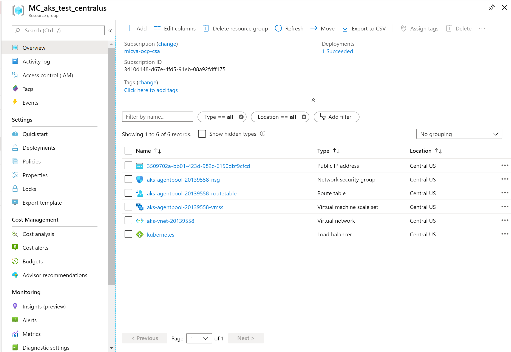
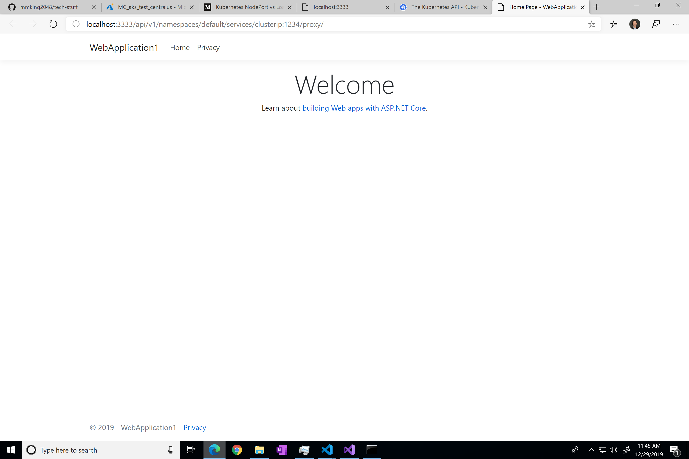
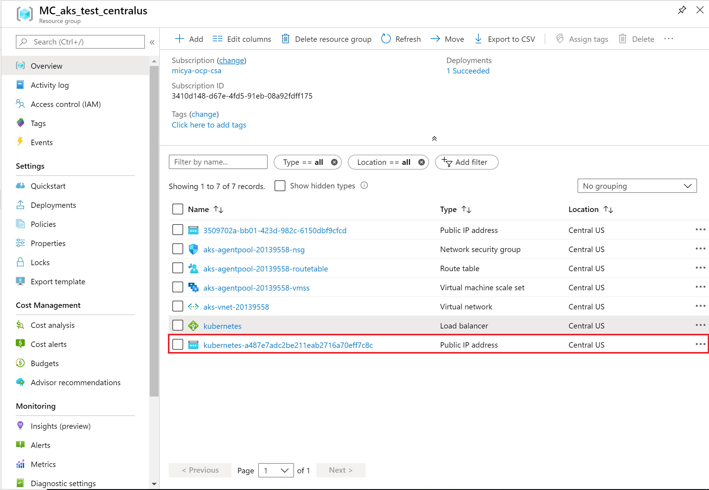
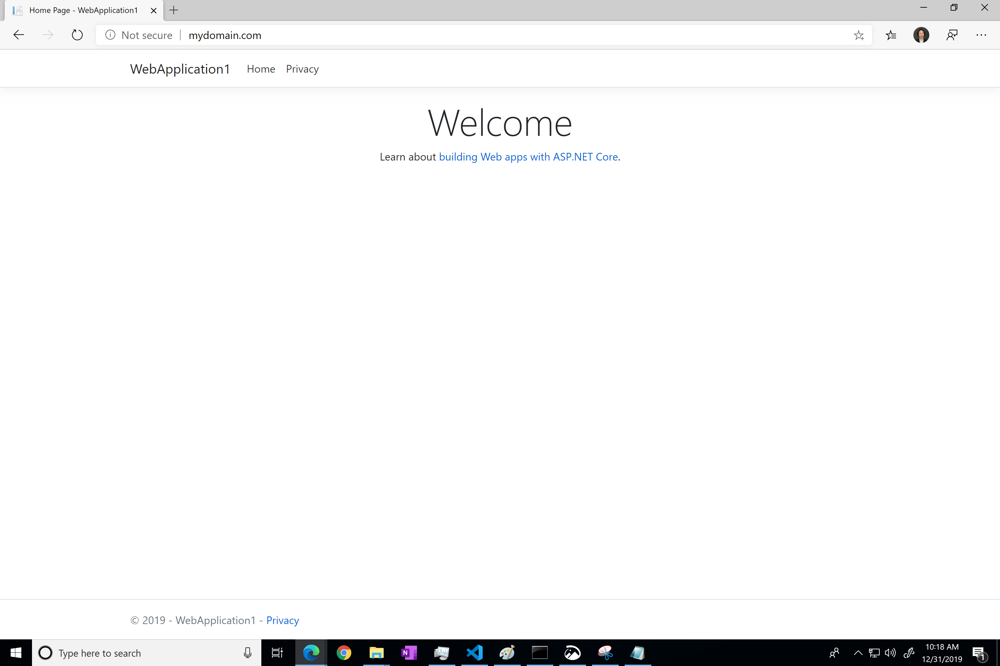

There is a good [Medium post](https://medium.com/google-cloud/kubernetes-nodeport-vs-loadbalancer-vs-ingress-when-should-i-use-what-922f010849e0) detailing the differences between ClusterIP, NodePort, LoadBalancer, and Ingress in Kubernetes. These are my notes from testing each of them.

## Setup

For testing purposes, I created a blank ASP.NET core application, built a docker image, and pushed to the docker repository. The application looks like this:


I did most of my testing on an AKS cluster.

When provisioning an AKS cluster, a separate resource group is created with several resources in it:



To deploy the application to my kubernetes cluster, I used the following yaml ([deployment.yaml](deployment.yaml)):

``` yaml
apiVersion: apps/v1
kind: Deployment
metadata:
  name: webapplication1
spec:
  selector:
    matchLabels:
      app: webapplication1
  
  template:
    metadata:
      labels:
        app: webapplication1
    
    spec:
      containers:
      - name: webapplication1
  
        image: micya/webapplication1
        resources:
          limits:
            memory: "128Mi"
            cpu: "500m"
        ports:
        - containerPort: 80
```

Applied the yaml with the command

```
kubectl apply -f deployment.yaml
```

You should be able to see the deployment called "webapplication1" via `kubectl get deployments`.

Checking the pods, you should see one pod is up:

```
> kubectl get pods

NAME                               READY   STATUS    RESTARTS   AGE
webapplication1-5766f7ccc9-hs47q   1/1     Running   0          10m
```

## Port forwarding

The easiest way to access the application while testing is to do a simple port forwarding to the pod.

```
kubectl port-forward webapplication1-5766f7ccc9-hs47q 1234:80
```

In the above command, this maps a port (1234) on your local machine to a port (80) on the pod (webapplication1-5766f7ccc9-hs47q).

Navigating to http://localhost:1234/ in a browser, you should see the application as expected.


## ClusterIP

A ClusterIP is a service that does an internal mapping within kubernetes and allows other apps within the cluster to access your application. Note that this does NOT allow external access.

To setup the ClusterIP service, the following yaml file was used ([clusterip.yaml](clusterip.yaml)):

``` yaml
apiVersion: v1
kind: Service
metadata:
  name: clusterip
spec:
  selector:
    app: webapplication1
  type: ClusterIP # default is ClusterIP if unspecified
  ports:
  - port: 1234 # kubernetes port
    targetPort: 80 # pod port
```

There are several things to note about the above file. First, the type in the above yaml file is specified as "ClusterIP". The type defaults to ClusterIP when unspecified . Second, the ports mapping is from kubernetes to the pod. Therefore, the "port" refers to the kubernetes port, and "targetPort" refers to the pod port.

Apply the yaml file:

```
kubectl apply -f clusterip.yaml
```

In order to access the application, we need a connection between the local machine and the kubernetes service. This can be done through the kubernetes proxy.

Use the following command:

```
kubectl proxy --port=3333
```

The above command opens a connection on port 3333 on the local machine to the kubernetes service.

Navigating to http://localhost:3333/ gives access to the [Kubernetes API](https://kubernetes.io/docs/concepts/overview/kubernetes-api/).

To access the application, navigate to http://localhost:3333/api/v1/namespaces/default/services/clusterip:1234/proxy/. You should see the application as expected:



ClusterIP is primarily used for debugging or internal routing.

## NodePort

A NodePort service opens a port on all nodes. Traffic is routed from the nodes to the kubernetes service to each pod.

To setup the NodePort service, the following yaml file was used ([nodeport.yaml](nodeport.yaml)):

``` yaml
apiVersion: v1
kind: Service
metadata:
  name: nodeport
spec:
  selector:
    app: webapplication1
  type: NodePort
  ports:
  - port: 10 # kubernetes port, useless in this case (but still required)
    targetPort: 80 # pod port
    nodePort: 30080 # node port
```

Note that three ports are required for the ports section: port (the kubernetes port), targetPort (the pod port), and nodePort (the node or VM port).

Apply the yaml file:

```
kubectl apply -f nodeport.yaml
```

To access the application, we would need the IP address of the nodes. AKS does not expose node IPs, so I tested the nodeport with a local Docker for Desktop kubernetes cluster. Docker for Desktop nodes just map to localhost (see [this Stack Overflow post](https://stackoverflow.com/a/56558795/4342319)).

Navigating to http://localhost:30080/ shows the application as expected.

## LoadBalancer

A LoadBalancer is the recommended way to allow external traffic to the kubernetes cluster. External traffic would access exposed services on the kubernetes cluster through an external IP address.

For setup, the following yaml file was used ([loadbalancer.yaml](loadbalancer.yaml)):

``` yaml
apiVersion: v1
kind: Service
metadata:
  name: loadbalancer
spec:
  selector:
    app: webapplication1
  ports:
    - port: 3355 # external port
      targetPort: 80 # pod port
  type: LoadBalancer
```

Here, "port" refers to the external port (port on LoadBalancer) and "targetPort" refers to the pod port.

Apply this yaml file:

```
kubectl apply -f loadbalancer.yaml
```

Checking for services, there is a new LoadBalancer service with external IP address pending:

```
>kubectl get services
NAME           TYPE           CLUSTER-IP     EXTERNAL-IP   PORT(S)          AGE
kubernetes     ClusterIP      10.0.0.1       <none>        443/TCP          14d
loadbalancer   LoadBalancer   10.0.177.228   <pending>     3355:31619/TCP   6s
```

Checking again after a while:

```
>kubectl get services
NAME           TYPE           CLUSTER-IP     EXTERNAL-IP   PORT(S)          AGE
kubernetes     ClusterIP      10.0.0.1       <none>        443/TCP          14d
loadbalancer   LoadBalancer   10.0.177.228   13.86.5.32    3355:31619/TCP   83s
```

Navigating to http://13.86.5.32:3355/ shows the application as expected:


In the AKS resource group, new Public IP address has been created with the IP we see in `kubectl get services` (13.86.5.32), and this IP is associated with the LoadBalancer, allowing traffic to be routed to the cluster. So for each LoadBalancer service deployed through kubernetes, a Public IP address resource is created.



Deleting the LoadBalancer service automatically deletes the public ip in Azure as well.

## Ingress

Rather than specifying a LoadBalancer per service, it is possible to achieve more granular routing by using an ingress controller and ingress routes.

Install a simple ingress controller:

```
helm install nginx-ingress stable/nginx-ingress
```

Checking that the services are up:

```
> kubectl get services

NAME                            TYPE           CLUSTER-IP     EXTERNAL-IP    PORT(S)                      AGE
kubernetes                      ClusterIP      10.0.0.1       <none>         443/TCP                      14d
nginx-ingress-controller        LoadBalancer   10.0.250.183   13.86.7.172    80:30186/TCP,443:30723/TCP   17m
nginx-ingress-default-backend   ClusterIP      10.0.1.45      <none>         80/TCP                       17m
```

Ingress routes are specified by yaml files. A sample one is in [ingress.yaml](ingress.yaml):

``` yaml
apiVersion: extensions/v1beta1
kind: Ingress
metadata:
  name: ingress
spec:
  rules:
  - host: mydomain.com
    http:
      paths:
      - backend:
          serviceName: clusterip
          servicePort: 1234 # clusterip kubernetes port
```

Note that the above makes use of ClusterIP (defined in [clusterip.yaml](clusterip.yaml)) as ingress requires a ClusterIP service mapping.

The yaml file defines routing from the external ip to different services via different urls. Here, the only path defined is the default / path, referring to all urls of the form mydomain.com/*.

Apply the yaml file:

```
kubectl apply -f ingress.yaml
```

As host name was specified to be mydomain.com, kubernetes will expect to receive requests with this domain name. Thus it is necessary to map the external ip address of the ingress controller (13.86.7.172) to the domain name.

In Windows, this can be done by modifying the "C:\Windows\System32\drivers\etc\hosts" file and adding the following:

```
13.86.7.172 mydomain.com
```

Navigating to mydomain.com shows the application as expected.


