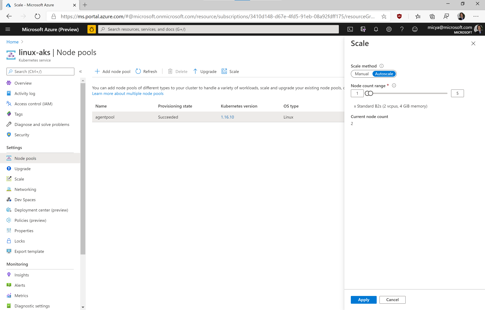

## Kubernetes scaling

### Concepts

- Pod
    - Atomic unit in kubernetes
    - Consists of one of more containers
    - https://kubernetes.io/docs/concepts/workloads/pods/pod/
- Deployments
    - Collection of zero or more identical pods
    - https://kubernetes.io/docs/concepts/workloads/controllers/deployment/
- Pod autoscaling/horizontal pod autoscaler
    - Automatically scale the number of pods in a deployment based on metrics
    - https://kubernetes.io/docs/tasks/run-application/horizontal-pod-autoscale/
- Cluster autoscaling
    - Automatically increase the number of nodes (VMs) in a cluster based on metrics
    - Usually handled by the cloud vendor
    - AKS: https://docs.microsoft.com/en-us/azure/aks/cluster-autoscaler

### Example setup

Create an example deployment:

```
$ kubectl create deployment hpa-example --image=k8s.gcr.io/hpa-example
deployment.apps/hpa-example created
```

Check the deployment:

```
$ kubectl get deployments
NAME          READY   UP-TO-DATE   AVAILABLE   AGE
hpa-example   1/1     1            1           61s
```

Note Ready 1/1. This indicates that the deployment expects to have one replica, and one replica is currently ready.

Check the pods in the deployment:

```
$ kubectl get pods
NAME                           READY   STATUS    RESTARTS   AGE
hpa-example-68fb5754f6-9gm7m   1/1     Running   0          84s
```

As expected, there is one pod running.

### Manual scaling

Manually scale the deployment:

```
$ kubectl scale deployment hpa-example --replicas=3
deployment.apps/hpa-example scaled
```

Check the deployment:

```
$ kubectl get deployments
NAME          READY   UP-TO-DATE   AVAILABLE   AGE
hpa-example   3/3     3            3           3m49s
```

Check the pods in the deployment:

```
$ kubectl get pods
NAME                           READY   STATUS    RESTARTS   AGE
hpa-example-68fb5754f6-9gm7m   1/1     Running   0          3m51s
hpa-example-68fb5754f6-9q29f   1/1     Running   0          35s
hpa-example-68fb5754f6-q7fm4   1/1     Running   0          35s
```

### Metrics server

- Collects metrics (CPU & memory) from each node and publishes to kubernetes
- https://github.com/kubernetes-sigs/metrics-server

Enabled by default in AKS.

Check pod CPU & memory usage:

```
$ kubectl top pod --all-namespaces
NAMESPACE     NAME                                         CPU(cores)   MEMORY(bytes)
default       hpa-example-68fb5754f6-9gm7m                 1m           9Mi
default       hpa-example-68fb5754f6-9q29f                 1m           9Mi
default       hpa-example-68fb5754f6-q7fm4                 1m           9Mi
kube-system   coredns-544d979687-2g54h                     3m           15Mi
kube-system   coredns-544d979687-ht7x6                     3m           19Mi
kube-system   coredns-autoscaler-78959b4578-7z5g2          1m           10Mi
kube-system   dashboard-metrics-scraper-5f44bbb8b5-2g9vg   1m           17Mi
kube-system   kube-proxy-tjpzw                             1m           33Mi
kube-system   kubernetes-dashboard-785654f667-cszqc        2m           18Mi
kube-system   metrics-server-85c57978c6-g6bmq              1m           20Mi
kube-system   omsagent-p6kc6                               9m           138Mi
kube-system   omsagent-rs-7886479cbf-h9vbf                 6m           221Mi
kube-system   tunnelfront-68c545cf48-wkj7s                 86m          23Mi
```

Check node CPU & memory usage:

```
$ kubectl top node
NAME                                CPU(cores)   CPU%   MEMORY(bytes)   MEMORY%
aks-agentpool-94895967-vmss000000   161m         8%     1898Mi          88%
```

### Request and limits

- Requests and limits can be specified on each container.
- Requests: Minimum resource usage. Kubernetes will reserve this for each pod and use this to schedule pods.
- Limits: Maximum resource usage. Kubernetes will throttle or kill pods that exceed the limit
- https://kubernetes.io/docs/concepts/configuration/manage-resources-containers/

**NOTE:** It is considered best practice to specify both request and limit. It is extremely important to specify limit, as failing to do so can result in starvation.

Example in [hpa-example.yaml](hpa-example.yaml):

``` yaml
apiVersion: apps/v1
kind: Deployment
metadata:
  name: hpa-example
spec:
  selector:
    matchLabels:
      app: hpa-example
  template:
    metadata:
      labels:
        app: hpa-example
    spec:
      containers:
      - name: hpa-example
        image: k8s.gcr.io/hpa-example
        resources:
          limits:
            memory: "128Mi"
            cpu: "1000m"
        ports:
        - containerPort: 80

---

apiVersion: v1
kind: Service
metadata:
  name: hpa-example
spec:
  selector:
    app: hpa-example
  ports:
  - port: 80
    targetPort: 80

```

### Autoscaling

Update the deployment by using hpa-example.yaml (note that a request needs to be set for the autoscaler to work):

```
$ kubectl delete deploy hpa-example
deployment.apps "hpa-example" deleted
$ kubectl apply -f hpa-example.yaml
deployment.apps/hpa-example created
service/hpa-example created
```

Set up pod autoscaling:

```
$ kubectl autoscale deployment hpa-example --max=10
horizontalpodautoscaler.autoscaling/hpa-example autoscaled
```

There is a new resource created called a horizontal pod autoscaler (HPA), which monitors the CPU usage relative to the pod CPU limit and autoscale threshold.

Check the HPA:

```
$ kubectl get hpa
NAME          REFERENCE                TARGETS   MINPODS   MAXPODS   REPLICAS   AGE
hpa-example   Deployment/hpa-example   0%/80%    1         10        1          64s
```

Configure the cluster autoscaler. From the portal, find the correct nodepool and configure scaling to automatic:



Apply load to the application using a busybox pod:

```
$ kubectl run busybox --image=busybox --restart=Never -- /bin/sh -c "while true; do wget -q -O- hpa-example; done"
pod/busybox created
```

Examine the autoscaler (it will take a few minutes to update):

```
$ kubectl get hpa -w
NAME          REFERENCE                TARGETS         MINPODS   MAXPODS   REPLICAS   AGE
hpa-example   Deployment/hpa-example   100%/80%        1         10        1          15s
hpa-example   Deployment/hpa-example   100%/80%        1         10        2          30s
hpa-example   Deployment/hpa-example   64%/80%         1         10        2          61s
```

Notice that the autoscaler has scaled up the number of pods in the deployment due to load.

Eventually the node will run out of resources to schedule new pods (pending state). Azure will add another node to the cluster:

```
$ kubectl get nodes
NAME                                STATUS   ROLES   AGE    VERSION
aks-agentpool-94895967-vmss000000   Ready    agent   7d1h   v1.16.10
aks-agentpool-94895967-vmss000003   Ready    agent   15m    v1.16.10
```

Stop the busybox pod, the autoscalers will work in tandem to scale down the number of pods and then nodes.

```
$ kubectl delete pod busybox
pod "busybox" deleted
```

Cleanup resources:

```
$ kubectl delete -f hpa-example
deployment.apps "hpa-example" deleted
service "hpa-example" deleted
$ kubectl delete hpa hpa-example
horizontalpodautoscaler.autoscaling "hpa-example" deleted
```

### Kubernetes event driven autoscaler (KEDA)

- Allows autoscaling by external metrics
- Example: autoscaling based on messages in a message queue
- https://keda.sh/
- Works by publishing external metrics to kubernetes and creating a horizontal pod autoscaler on top
- How it works: https://keda.sh/docs/1.5/concepts/
- Samples: https://github.com/kedacore/samples